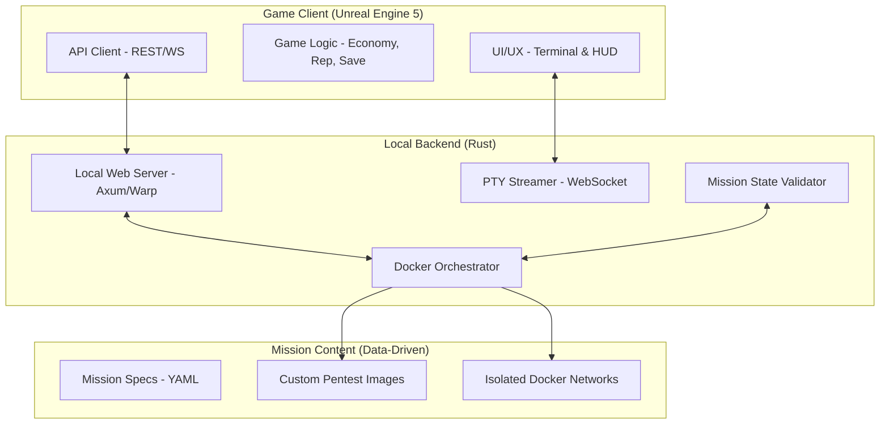

# Architecture: CyberLab

## 1. Components Overview

## 2. Communication Protocols
*   **REST API**: For mission selection, player state, economy, and general game metadata.
*   **WebSockets**: For real-time PTY (Pseudo-Terminal) bidirectional streaming between the UE5 terminal component and the backend.

## 3. Mission Lifecycle
1.  **Load**: Backend reads YAML spec.
2.  **Pull/Build**: Orchestrator ensures Docker images are present.
3.  **Start**: Orchestrator runs `docker-compose` or equivalent.
4.  **Connect**: UE5 UI establishes WebSocket to PTY.
5.  **Monitor**: Backend watches for file changes or process flags inside container (Validation).
6.  **Cleanup**: On mission end, containers are wiped.

## 4. Security Layer
*   **No Exit**: Docker containers configured with no bridge to host ethernet.
*   **Resource Limits**: CPU/RAM caps per mission to prevent host freezing.
*   **Command Filtering**: Log and potentially block dangerous (but useless in-game) patterns.
